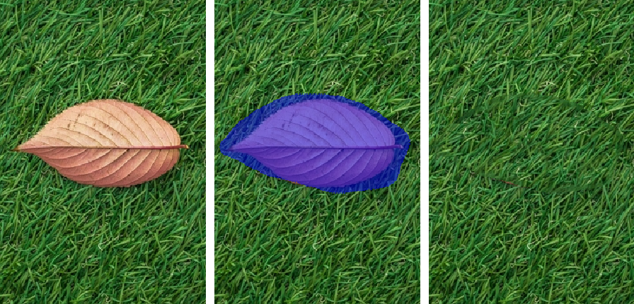

									
# PatchMatch: Hole Filling

Take an input image (left) and mark some of its pixels as a "hole" to be filled (blue). The PatchMatch algorithm
fills the hole from other parts of the image (right), ideally producing a seamless blend. 

by Greg Philbrick (Copyright 2024)
						
## Description	

The [PatchMatch](https://gfx.cs.princeton.edu/pubs/Barnes_2009_PAR/index.php) algorithm, presented by Barnes et al.,
finds a pixel-to-pixel correspondences between two images A and B. More specifically, it finds,
for each NxN patch of image A, the best corresponding NxN patch of image B. Finding this patch-to-patch correspondence
allows for some interesting image editing operations, in particular "hole filling," the focus of this repository.

In a hole-filling operation, a user marks some pixels in an input image and requests that these pixels be 
intelligently "deleted," e.g., that these pixels be filled with image content taken from unmarked pixels—that is,
from outside the hole. (See Photoshop's "Content-Aware Delete" tool.) The PatchMatch algorithm
can achieve this effect by treating the hole (the marked pixels) as one image—called the "target" in my code—and the 
rest of the input image as a separate image—the "source."

I offer two implementations of PatchMatch-based hole filling: one built in OpenCL to run on the GPU, the
other in pure C++. You can interactively run both of these implementations from the HoleFillApplication executable. The OpenCL 
implementation not only runs faster—no surprise there—but produces more seamless fills, suggesting an undiagnosed issue 
in the C++-only version. (This code comes from my research years as a master's student.)

If you are not interested in running the code and just want to view it for insights into the PatchMatch algorithm,
start out at [holefillpatchmatchopencl.h](PatchMatch/PatchMatch/holefillpatchmatchopencl.h) and 
[PatchMatch/holefillpatchmatch.h](PatchMatch/PatchMatch/holefillpatchmatch.h).

## How to Build / 3rd-Party Dependencies

CMake needs to know how to find these on your machine:

* [Boost](https://www.boost.org/)		
* [Qt 5.15+ or 6](https://doc.qt.io/qt-6/get-and-install-qt.html)
* [OpenMP](https://www.openmp.org/)
* OpenCL

Note that just having an OpenCL-capable video card is not enough; OpenCL itself must be installed. I most recently
accomplished this by installing the NVIDIA's CUDA SDK, which is overkill but simple.

## How to Run

Once you have configured and built the project, run the HoleFillApplication target. The first time you run,
you will be asked to pick an OpenCL device (there may be more than one if you have multiple
GPUs). 

To mark a hole to fill, click and drag on the image. Once your hole is marked, you can either (1) complete
the hole-fill operation using the OpenCL implementation, (2) complete the hole-fill operation using the 
non-OpenCL implementation, or (3) begin a "manual" application of the non-OpenCL implementation. The third
option lets you move through the steps of the algorithm and observe the progress. Note that this involves
moving through a sequence of pyramid levels, starting out at a very low-resolution version of the problem
and finishing at a full-resolution version, i.e., pyramid level 0. At each pyramid level you can "refine"
the NNF as many times as you like. After each "Refine NNF" click, a new "blend" will be performed, allowing
you to see how the NNF has changed. 

## License
					
My code is under the Boost Software License v1.0. See LICENSE.txt.